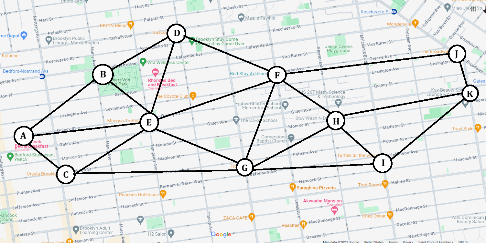

---

# **Fastest Route Finder using Dijkstra's Algorithm**

This project aims to **identify the fastest route** between two points on a map by implementing **Dijkstra's Algorithm**. Scenarios such as **rush hour traffic** and **road uncertainties** are simulated to evaluate the impact on travel times and route optimization.

---

## **Project Overview**
In real-world transportation networks, identifying the fastest path under different scenarios is crucial for route planning. This project:
- Represents locations as a **graph** with weighted edges (travel time).
- Implements **Dijkstra's Algorithm** to calculate the shortest route.
- Simulates real-world conditions like **rush hour traffic** and **roadblocks** for robust analysis.

---

## **Graph Design**
The map includes:
- **Nodes**: Specific locations in **New York City** (labeled A to K).
- **Edges**: Travel time between nodes (weighted graph).

The base graph:
  
*Example: The nodes A to K are interconnected, forming the map's structure.*

---

## **Key Features**
### 1. **Dijkstra's Algorithm**
- Finds the **shortest path** in a weighted graph.
- **Steps**:
   1. Initialize distances and paths for all nodes.
   2. Use a **min-heap priority queue** to explore nodes with the smallest distance.
   3. Update distances and paths for neighboring nodes dynamically.
   4. Return the shortest path and distance.

---

### 2. **Uncertainty Simulation**
Simulates random **roadblocks** or disruptions in the network:
- Introduces uncertainty to edge weights based on a **probability threshold**.
- Significantly increases travel time for disrupted paths to simulate real-world delays.

---

### 3. **Rush Hour Simulation**
Models **heavy traffic** conditions by:
- Multiplying edge weights by a **random factor** (1 to 3).
- Combining traffic disruptions with **uncertainty simulation** for realistic analysis.

---

## **Scenarios and Results**
### **1. Base Case Scenario**
- **Without Uncertainty**:  
   Fastest path: `['A', 'E', 'F', 'J', 'K']` with total time **12.2**.
- **With Uncertainty**:  
   Disruptions force longer paths; total time increases.

### **2. Rush Hour Scenario**
- **Without Uncertainty**:  
   Heavy traffic increases travel time: **28.82**.
- **With Uncertainty**:  
   Combined traffic and disruptions worsen travel efficiency: **86.91**.

---

## **Data Structures**
- **Graph**: Represented as an adjacency list.
- **Priority Queue**: Used for Dijkstra's algorithm with `heapq`.
- **Distances & Paths**: Track shortest known distances and routes.

---

## **Manual Validation**
Alternative paths were manually tested:
- Path `['A', 'E', 'F', 'H', 'K']`: Time = **13.1**  
- Path `['A', 'C', 'G', 'I', 'K']`: Time = **14.2**  

Dijkstra's Algorithm consistently produced the **optimal path**, confirming its accuracy.

---

## **Analysis of Results**
- **Rush Hour** increases travel time due to traffic factors.
- **Uncertainty** (roadblocks) forces longer routes, further increasing delays.
- **Symmetry**: Travel time between two nodes is consistent in both directions, simplifying round-trip calculations.

---

## **Setup and Usage**
1. **Clone the repository**:
   ```bash
   git clone https://github.com/ShreCodes2809/Fastest_Route.git
   cd Fastest_Route
   ```

2. **Sample Outputs**:
   - Base Case (No Uncertainty)
   - Rush Hour (With/Without Uncertainty)

---

## **System Requirements**
- Python 3.8+
- Libraries: `heapq`, `random`, `matplotlib`, `copy`

---

## **Future Enhancements**
- Extend to **real-world maps** using GIS data.
- Optimize for **edge devices** with limited resources.
- Integrate with **Google Maps API** for real-time traffic.

---

## **Contributing**
Contributions are welcome:
1. Fork the repository.
2. Add your improvements in a new branch.
3. Submit a pull request.

---

## **Credits**
This project was created as part of **DTSC 5501-001** coursework by **Group18**:
- Arihant Sikarwar  
- Lohith Ramesh  
- Shreyash Sahare  

---
